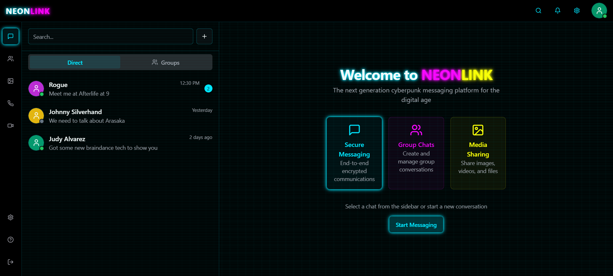

# NeonLink - Cyberpunk Messaging Platform

<div align="center">
  
  <h3>The next generation cyberpunk messaging platform for the digital age</h3>
</div>

## 🌟 Overview

NeonLink is a futuristic, cyberpunk-themed messaging application built with Next.js and styled with Tailwind CSS. It features a sleek, neon-infused UI with a dark aesthetic inspired by the cyberpunk genre. The application simulates a complete messaging platform with direct messages, group chats, media sharing, and more.

## ✨ Features

- **Secure Messaging** - End-to-end encrypted communications (simulated)
- **Group Chats** - Create and manage group conversations
- **Media Sharing** - Share images, videos, and files
- **Video & Audio Calls** - Make video and audio calls to contacts (simulated)
- **User Profiles** - Customizable user profiles with status indicators
- **Dark Mode** - Sleek cyberpunk-themed dark interface with neon accents
- **Responsive Design** - Works on desktop and mobile devices

## 🚀 Live Demo

Check out the live demo: [NeonLink Demo](https://neonlink-demo.vercel.app)

## 🛠️ Technologies Used

- **Next.js** - React framework for server-side rendering and routing
- **React** - UI component library
- **Tailwind CSS** - Utility-first CSS framework
- **Shadcn UI** - High-quality UI components built with Radix UI and Tailwind
- **Framer Motion** - Animation library for React
- **Lucide Icons** - Beautiful open-source icons

## 📋 Getting Started

### Prerequisites

- Node.js 18.x or higher
- npm or yarn

### Installation

1. Clone the repository:
   ```bash
   git clone https://github.com/SarahE-Dev/neonlink.git
   cd neonlink
```

2. Install dependencies:

```shellscript
npm install
# or
yarn install
```


3. Run the development server:

```shellscript
npm run dev
# or
yarn dev
```


4. Open [http://localhost:3000](http://localhost:3000) in your browser to see the application.


## 📱 Application Structure

- **Chats** - Direct messaging interface with contacts
- **Groups** - Group chat management and conversations
- **Media** - Gallery for shared media files
- **Calls** - Audio call history and interface
- **Video** - Video call interface with multi-user support
- **Settings** - User preferences and application settings
- **Help** - Documentation and support resources


## 🎨 UI Components

NeonLink features custom-designed UI components with cyberpunk aesthetics:

- Neon borders and text effects
- Glitch animations on hover
- Scanline overlays for immersion
- Cyber grid backgrounds
- Animated message transitions
- Typing indicators with neon styling


## 🧩 Project Structure

```plaintext
neonlink/
├── app/                  # Next.js app directory
│   ├── chats/            # Chat routes
│   ├── groups/           # Group routes
│   ├── media/            # Media routes
│   ├── calls/            # Call routes
│   ├── video/            # Video routes
│   ├── settings/         # Settings routes
│   ├── help/             # Help routes
│   ├── logout/           # Logout route
│   ├── layout.tsx        # Root layout
│   ├── page.tsx          # Home page
│   └── globals.css       # Global styles
├── components/           # React components
│   ├── ui/               # UI components (shadcn)
│   ├── chat-list.tsx     # Chat list component
│   ├── chat-view.tsx     # Chat view component
│   └── ...               # Other components
├── lib/                  # Utility functions
│   ├── utils.ts          # Utility functions
│   └── mock-data.ts      # Mock data for demonstration
├── public/               # Static assets
├── next.config.mjs       # Next.js configuration
└── tailwind.config.ts    # Tailwind CSS configuration
```

## 📝 Notes

- This is a demonstration project and does not include actual backend functionality
- User data and messages are simulated using mock data
- The application is designed to showcase UI/UX design and front-end development skills


## 🔮 Future Enhancements

- Backend integration with real-time messaging
- Authentication system
- Actual end-to-end encryption
- File upload functionality
- Voice messages
- Custom themes
- Mobile app versions


## 📄 License

This project is licensed under the MIT License - see the LICENSE file for details.

## 👩‍💻 Author

**Sarah E** - [GitHub Profile](https://github.com/SarahE-Dev)

---

